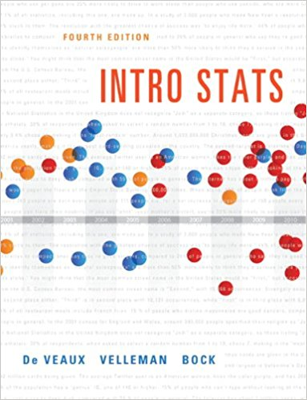

These documents are intended to help describe how to undertake analyses introduced 
as examples in the **_Fourth Edition of Intro Stats_** (2013) by De Veaux, Velleman, and Bock.
More information about the book can be found [here](http://wps.aw.com/aw_deveaux_stats_series).  

Other resources related to the mosaic package can be found under the 'Other Resources' tab. 

